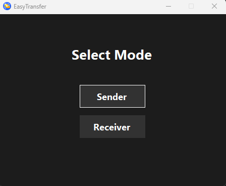
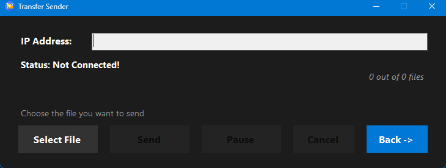
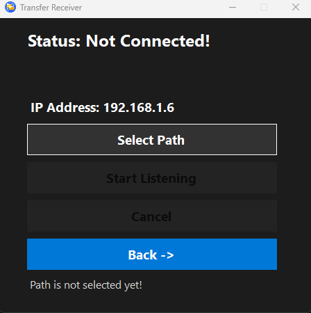

# EasyTransfer - Seamless TCP Data Sharing

Easily transfer files between two Windows PCs over TCP with a user-friendly interface and reliable performance.

---

## Features
- **High-Speed TCP-Based File Transfer**: Ensures reliable and fast data sharing.
- **Secure Transmission**: Provides a safe channel for file transfers.
- **User-Friendly Interface**: Simple and intuitive UI to choose between Sender and Receiver modes.
- **Supports Large Files**: Designed for transferring files of any size.
- **Real-Time Status Updates**: Stay informed about the transfer progress.

---

## Screenshots

### Mode Selection
The main interface allows you to choose between Sender and Receiver modes.

### Sender UI
The Sender app interface allows you to input the recipient's IP address, select files to send, and manage the transfer process.

### Receiver UI
The Receiver app interface enables you to set up a directory for saving incoming files and listen for transfers.

---

## How It Works

1. **Setup**
   - Ensure both PCs are connected to the same network.
   - Launch the application and choose the desired mode (Sender or Receiver).

2. **Sender Side**
   - Enter the Receiver's IP address.
   - Select the file(s) to send.
   - Click **Send** to start the transfer.

3. **Receiver Side**
   - Select a directory to save the incoming files.
   - Click **Start Listening** to prepare for the transfer.

4. **File Transfer**
   - Once the Receiver starts listening, the Sender app begins the transfer.
   - Both applications provide real-time status updates.

---

## Installation

1. **Download the Application**
   - [Download the latest release](#) from the Releases section.

2. **Requirements**
   - Windows 10 or higher.
   - .NET Framework (if required).

3. **Run the Executable**
   - Extract the downloaded files and run `EasyTransfer.exe` to choose between Sender and Receiver modes.

---

## Contributing

Contributions are welcome! If you encounter any issues or have suggestions, feel free to open an [issue](#) or submit a pull request.

---

## License

This project is licensed under the MIT License. See the [LICENSE](LICENSE) file for details.

---

## Acknowledgments

- Thanks to the community for support and feedback.
- Built with passion using TCP and Windows Forms.

---

## Contact

For any questions or support, feel free to reach out via the [issues page](#).
